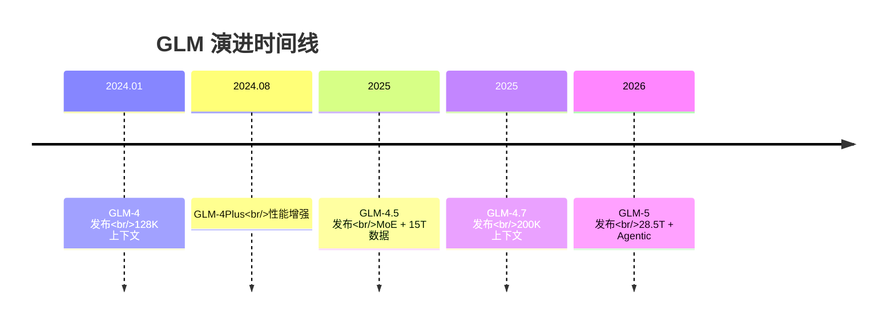
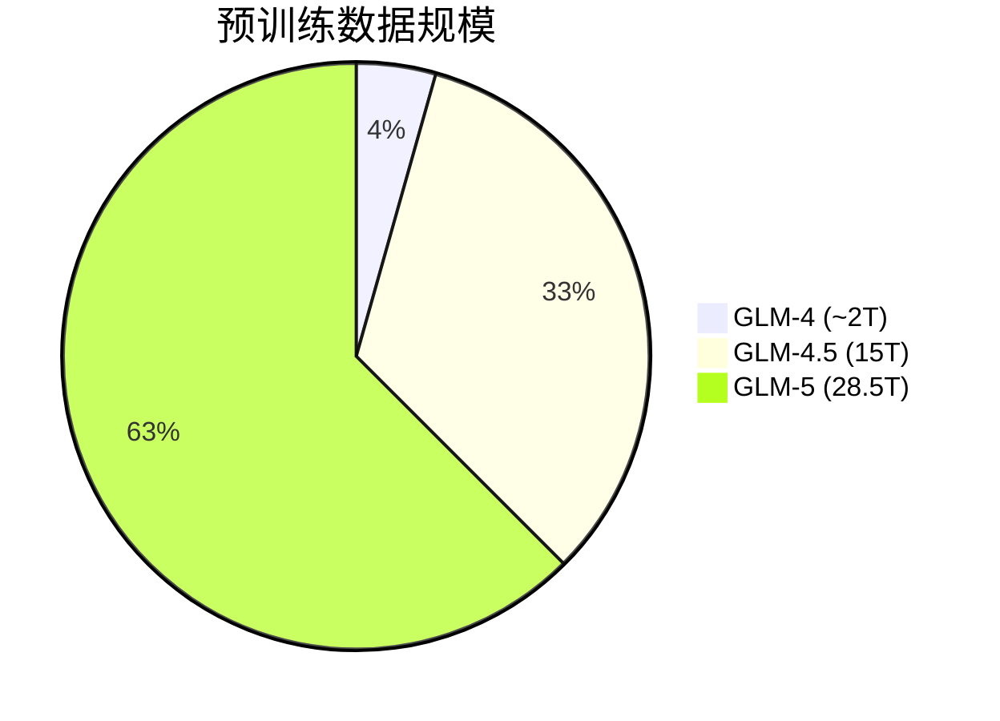

# GLM 系列模型整体演进

> 📊 一页式整体汇报（5-10 分钟）

---

## 一、GLM 系列发展历程



---

## 二、核心参数对比

| 模型 | 发布时间 | 架构 | 训练数据 | 上下文 | 特点 |
|------|----------|------|----------|--------|------|
| GLM-4 | 2024.1 | Dense | ~2T | 128K | 基础旗舰 |
| GLM-4V | 2024.1 | Dense | - | - | 视觉多模态 |
| GLM-4Plus | 2024.8 | Dense | - | - | 性能增强 |
| **GLM-4.5** | 2025 | **MoE** | 15T | 128K | Reasoning/Coding/Agent |
| **GLM-4.7** | 2025 | **MoE** | - | **200K** | 编程/多步执行 |
| **GLM-5** | 2026 | **MoE+DSA** | **28.5T** | **200K** | **Agentic Engineering** |

---

## 三、技术架构演进

```
GLM-4        →  GLM-4.5      →  GLM-4.7     →  GLM-5
Dense        →  MoE          →  MoE         →  MoE + DSA
(传统Transformer)  (混合专家)      (混合专家)     (混合专家 + 直接自注意力)
```

### 关键技术点

- **MoE (Mixture of Experts)**：160→256 专家，推理时激活部分专家
- **DSA (Direct Self-Attention)**：GLM-5 新型注意力机制
- **长上下文**：128K → 200K

---

## 四、训练数据规模



| 模型 | 预训练 Token | 数据重点 |
|------|-------------|----------|
| GLM-4 | ~2T | 通用文本 |
| GLM-4.5 | **15T** | Code + Reasoning + Agent |
| GLM-5 | **28.5T** | 代码/Agent/复杂任务 |

---

## 五、适用场景

| 场景 | 推荐模型 |
|------|----------|
| 基础对话 | GLM-4 |
| 视觉理解 | GLM-4V |
| **代码生成** | **GLM-4.7 / GLM-5** |
| **Agent 开发** | **GLM-5** |
| 长文档处理 | GLM-4.7 / GLM-5 |
| 多模态 | GLM-4V 系列 |

---

## 六、GLM-5 核心亮点

### 🎯 Agentic Engineering

专为 Agent 场景设计：
- 工具调用能力强化
- 长程规划能力
- 复杂任务执行

### 📊 数据规模领先

- **28.5T** 预训练数据（业界领先）
- 200K 超长上下文

### 🏗️ 架构创新

- **256 专家 MoE**
- **DSA 新型注意力**
- 更高效的推理

---

## 七、总结

| 维度 | GLM-5 定位 |
|------|------------|
| **目标** | Agentic Engineering 基础设施 |
| **数据** | 28.5T tokens |
| **架构** | MoE + DSA |
| **上下文** | 200K |
| **生态** | Z.AI 开发者平台 |

**一句话**：GLM-5 是面向 Agent 时代的新一代基座模型。

---

*最后更新：2026-03-18*

---

## 八、GLM-5 Agentic Engineering 详解

### 什么是 Agentic Engineering？

训练模型具备：**工具使用 + 长程规划 + 自主决策 + 环境交互**

### GLM-5 专项训练

| 训练方向 | 内容 |
|---------|------|
| 工具调用 | 函数调用专项、API 格式强化 |
| Agent 任务 | 多步推理、问题分解、自我纠错 |
| 强化学习 | RLHF、场景偏好优化 |

### 与 GLM-4 对比

| 能力 | GLM-4 | GLM-5 |
|------|-------|-------|
| 工具调用 | 基础 | ⭐ 专项优化 |
| 多步推理 | 一般 | ⭐ 显著提升 |
| Agent 场景 | 弱 | ⭐ 核心定位 |

### 适用场景

- AI Agent 开发
- 代码生成与调试
- 复杂任务自动化
- 企业级应用集成
