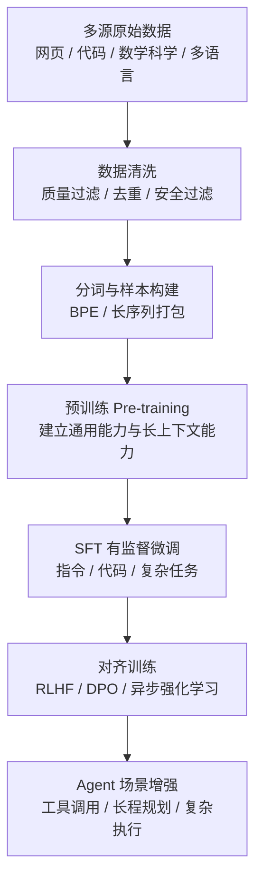
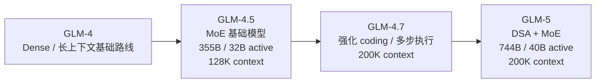
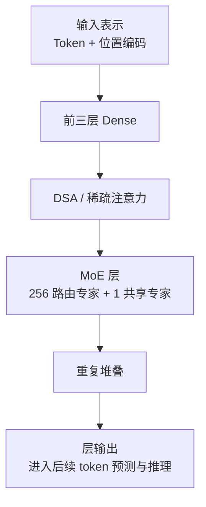

# GLM 系列模型训练洞察

## 模型系列

- **GLM-4** (2024年1月) - 智谱 / Z.AI 旗舰模型，支持长上下文
- **GLM-4V** (2024年1月) - 视觉多模态版本
- **GLM-4Plus** (2024年8月) - 增强版，性能提升
- **GLM-4.5** (2025年) - 面向 reasoning / coding / agent 的 MoE 基础模型，128K 上下文
- **GLM-4.7** (2025年) - 在 4.5 路线上继续强化编程、多步执行与前端生成能力，200K 上下文
- **GLM-5** (2026年) - 新一代旗舰基础模型，面向 **Agentic Engineering**

## 训练流程



### 1. 预训练 (Pre-training)

#### 数据来源与配比（公开资料总结 / 部分推断）

| 版本 | 预训练 Token 数 | 数据来源 |
|------|----------------|----------|
| GLM-4 | ~2T | 网页、代码、书籍、学术论文 |
| GLM-4.5 | **15T**（官方文档） | 通用数据 + code / reasoning / agent 任务数据 |
| GLM-4.7 | 未完全公开 | 延续 4.5 路线，重点强化编程与复杂 Agent 执行相关数据 |
| GLM-5 | **28.5T**（官博/官方文档） | 多源大规模高质量数据，面向代码、Agent 与复杂任务场景 |

**GLM-5 数据特点（公开资料总结 / 部分推断）**：
- **通用文本**：作为基础，支撑通用语言与知识能力
- **代码与工程数据**：官方重点强调 coding 与 software engineering 场景
- **数学 / 科学 / 推理数据**：服务复杂推理与 benchmark 表现
- **长任务链相关数据**：服务 long-range Agent tasks 与复杂系统工程场景
- **多语言 / 专业文本**：支撑更广泛实际应用能力

> 注：GLM-5 的精确数据配比未完全公开，当前更适合描述为训练方向总结，而不是官方定稿比例表。

#### 数据清洗方法

1. **质量过滤**：
   - 基于规则和统计特征的启发式过滤
   - 困惑度 / 质量评分辅助筛选
   - 面向代码和长任务数据的质量控制

2. **去重策略**：
   - 文档级精确去重
   - 近似去重（如 MinHash / LSH 类方法）

3. **分词器**：
   - **BPE 分词器**
   - **词表大小**：约 **154,880**（HF config）

#### 训练配置

| 模型 | 隐藏层 | 注意力头 | FFN / 专家结构 | 上下文长度 |
|------|--------|----------|----------------|-----------|
| GLM-4 9B | 40 | 32 | 11008 | 128K |
| GLM-4 130B | 80 | 64 | 20480 | 128K |
| GLM-4.5 | 92 | 96 | MoE，160 路由专家 + 1 共享专家 | **128K**（官方文档 / HF config） |
| GLM-4.7 | 92 | 96 | MoE，160 路由专家 + 1 共享专家 | **200K**（官方文档 / HF config） |
| GLM-5 | 78 | 64 | MoE + DSA，256 路由专家 + 1 共享专家 | **200K**（官方文档） |

**训练超参数（公开资料总结 / 部分推断）**：
- **优化器**：AdamW 路线
- **学习率调度**：Warmup + Cosine 类策略
- **权重衰减**：0.1 量级
- **梯度裁剪**：用于保证大规模训练稳定性

> 注：GLM-5 官方没有完整公开全部训练超参数，上述更适合视作常见训练路线总结。

### 2. 有监督微调 (SFT)

#### 数据来源

| 数据集类型 | 描述 |
|-----------|------|
| 高质量人工标注对话 | 指令跟随、复杂问答、工作流任务 |
| 代码与系统工程任务 | 面向 agentic coding、调试、重构 |
| 工具调用与结构化输出数据 | 支撑 function calling / structured output |

#### 训练配置
- **学习率**：1e-5 ~ 2e-5（行业常见量级）
- **Epochs**：1-3
- **批量大小**：按模型规模动态调整
- **重点方向**：代码、复杂任务分解、长任务链行为一致性

### 3. 对齐训练 (RLHF / DPO / 异步强化学习)

#### GLM-4.5 / 4.7 / 5 对齐重点（官方资料 + 公开总结）
- **GLM-4.5**：官方明确提到预训练后继续进行面向 **code、reasoning、agent-specific tasks** 的 targeted fine-tuning，并用强化学习提升 reasoning、coding、agent performance
- **GLM-4.7**：官方重点强调 **enhanced programming capabilities**、**more stable multi-step reasoning / execution**，并引入 retained reasoning 与 round-based reasoning 以增强复杂任务可控性
- **GLM-5**：官方明确将其定位为面向复杂系统工程与长程 Agent 任务的旗舰模型
- **异步强化学习**：GLM-5 官方提到新的 **Slime** 框架，用于支持更大模型规模与更复杂 RL 任务
- **长程交互学习**：通过异步 agent reinforcement learning，让模型从长范围交互中持续学习
- **工具调用与复杂执行**：围绕多步任务、资源管理、依赖协调与目标保持能力持续增强

## 架构特点

### 1. GLM-4 / 4.5 / 4.7 / 5 演进路线



- **GLM-4**：Transformer Decoder 基础路线
- **GLM-4.5**：显式转向 reasoning / coding / agent 场景的 MoE 基础模型
- **GLM-4.7**：延续 4.5 结构骨架，重点增强编程、多步执行稳定性与前端生成能力
- **GLM-5**：进一步引入 DSA 与更大规模基础模型，面向 Agentic Engineering

### 2. GLM-5 架构



**GLM-5 核心特点**：
- **官方参数规模**：从 **355B（32B activated）** 提升到 **744B（40B activated）**
- **预训练数据**：从 **23T** 升级到 **28.5T**
- **Sparse Attention Mechanism**：官方明确提到首次整合 **DeepSeek Sparse Attention**
- **MoE 路线**：HF config 可见：
  - `n_routed_experts = 256`
  - `n_shared_experts = 1`
  - `num_experts_per_tok = 8`
- **首三层 Dense**：HF config 中 `first_k_dense_replace = 3`
- **上下文长度**：官方文档给出 **200K context**，**128K maximum output tokens**

### 3. 位置编码

- **RoPE**：基础位置编码路线
- **长上下文外推**：围绕 200K 上下文进行配置与优化
- **rope_theta = 1000000**（HF config）

### 4. 注意力机制

- **DeepSeek Sparse Attention (DSA)**：官方明确提及
- **Token Efficiency**：官方强调在保持长文本性能的同时降低部署成本
- **Index 相关结构**：HF config 可见 `index_topk = 2048` 等参数，说明稀疏选择机制参与计算

### 5. MoE 结构

- **总规模**：744B
- **激活参数**：40B
- **路由专家**：256
- **共享专家**：1
- **每 token 激活专家**：8

## 技术亮点

### GLM-4.5 / 4.7 / 5 官方可直接确认的信息

#### GLM-4.5
- **定位**：面向 reasoning、coding、agent-oriented applications 的基础模型
- **参数规模**：**355B total / 32B activated**
- **轻量版本**：GLM-4.5-Air 为 **106B total / 12B activated**
- **预训练数据**：**15T**
- **上下文长度**：**128K**
- **最大输出长度**：**96K**
- **后训练**：官方明确提到强化学习用于增强 reasoning、coding 与 agent performance

#### GLM-4.7
- **定位**：在 4.5 路线上继续强化 programming capabilities 与 stable multi-step reasoning / execution
- **上下文长度**：**200K**
- **最大输出长度**：**128K**
- **能力重点**：coding、tool invocation、frontend aesthetics、复杂多步任务执行
- **官方 benchmark 表述**：在 SWE-bench Verified、LiveCodeBench V6、τ²-Bench 等任务上强调开源领先表现

#### GLM-5
- **定位**：Z.AI 新一代旗舰基础模型，面向 **Agentic Engineering**
- **上下文长度**：**200K**
- **最大输出长度**：**128K**
- **参数规模**：**744B total / 40B activated**
- **预训练数据**：**28.5T**
- **Sparse Attention**：首次整合 **DeepSeek Sparse Attention**
- **异步强化学习框架**：**Slime**
- **Coding 能力**：官方声称在 SWE-bench Verified、Terminal Bench 2.0 等公开 benchmark 上达到开源领先表现
- **Agent 能力**：官方强调 BrowseComp、MCP-Atlas、τ²-Bench 等长程 agent 能力 benchmark 表现

### GLM-5 的训练意义

从训练角度看，GLM-5 最重要的不是“更大”本身，而是：
- 用更大的基础模型与更大数据规模支撑复杂任务
- 用 DSA 降低长上下文建模成本
- 用 MoE 提高模型容量与效率比
- 用异步强化学习强化长程 agent 交互能力

## 训练资源

| 模型 | 规模 | 预估训练资源 |
|------|------|------------|
| GLM-4 9B | 9B | 8x A100 量级 |
| GLM-4 130B | 130B | 64+ x A100 / H100 量级 |
| GLM-5 | 744B / 40B activated | 超大规模集群（官方未完全公开） |

> 注：GLM-5 的完整训练资源未完全公开，这里只做规模级别判断。

## 数据格式

### 预训练格式
```json
{"text": "文本内容", "source": "web|code|paper|doc"}
```

### SFT格式
```json
{
  "messages": [
    {"role": "user", "content": "用户问题"},
    {"role": "assistant", "content": "模型回答"}
  ]
}
```

### 工具调用 / 结构化输出格式
```json
{
  "messages": [
    {"role": "user", "content": "请提取合同中的甲乙双方与金额"}
  ],
  "tools": [
    {"name": "extract_contract_fields", "input_schema": {"type": "object"}}
  ]
}
```

## 参考文献

1. **GLM-4.5 官方博客 / 文档**: https://z.ai/blog/glm-4.5
2. **GLM-4.5 官方文档**: https://docs.z.ai/guides/llm/glm-4.5
3. **GLM-4.5 Hugging Face 配置**: https://huggingface.co/zai-org/GLM-4.5/blob/main/config.json
4. **GLM-4.7 官方博客**: https://z.ai/blog/glm-4.7
5. **GLM-4.7 官方文档**: https://docs.z.ai/guides/llm/glm-4.7
6. **GLM-4.7 Hugging Face 配置**: https://huggingface.co/zai-org/GLM-4.7/blob/main/config.json
7. **GLM-5 官方博客**: https://z.ai/blog/glm-5
8. **GLM-5 官方文档**: https://docs.z.ai/guides/llm/glm-5
9. **GLM-5 Hugging Face 配置**: https://huggingface.co/zai-org/GLM-5/blob/main/config.json
10. **GLM-130B**: https://arxiv.org/abs/2210.05858
11. **Z.AI 开发者文档**: https://docs.z.ai/

---

*最后更新：2026*
