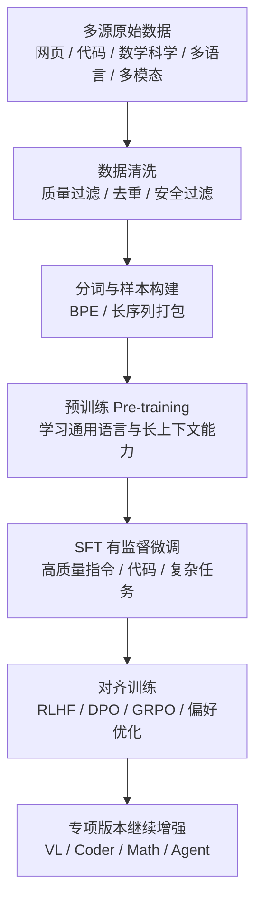
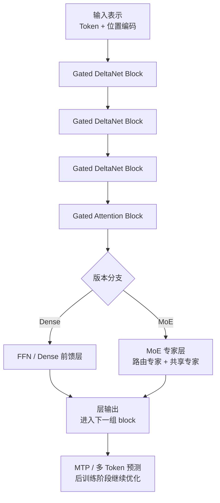
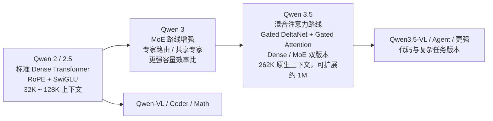

# QWEN 系列模型训练洞察

## 模型系列

- **Qwen 1** (2023年4月) - 阿里首代大模型
- **Qwen 1.5** (2024年2月) - 优化版
- **Qwen 2** (2024年5月) - 全面升级
- **Qwen 2.5** (2024年9月) - 性能大幅提升
- **Qwen 3** (2025年) - 新一代旗舰，MoE 版本引入专家路由
- **Qwen 3.5** (2026年) - 混合注意力路线，原生超长上下文，包含 Dense / MoE 双版本
- **Qwen-VL / Qwen3.5-VL** - 视觉多模态版本
- **Qwen-Coder** - 代码专用版本
- **Qwen-Math** - 数学专用版本

## 训练流程



### 1. 预训练 (Pre-training)

#### 数据来源与配比（公开资料总结 / 部分推断）

| 版本 | 预训练 Token 数 | 数据来源 |
|------|----------------|----------|
| Qwen 2 | ~2.2T | 网页、代码、书籍、学术 |
| Qwen 2.5 | ~3T+ | 大规模多源数据 |
| Qwen 3 | >18T | 18T+高质量数据 |
| Qwen 3.5 | 未完全公开 | 高质量网页、代码、数学/科学、多语言、多模态相关数据 |

**Qwen 2.5 数据配比**：
- **网页文本**：50%
- **代码**：25%
- **学术/数学**：15%
- **图书**：10%

**Qwen 3 数据配比**：
- **高质量网页**：40%
- **代码**：25%
- **数学/科学**：20%
- **多语言文本**：15%

**Qwen 3.5 数据特点（公开信息推断）**：
- **高质量网页 / 通用文本**：继续作为主体，支撑通用语言能力
- **代码与技术文档**：保持较高占比，服务代码与 Agent 场景
- **数学 / 科学 / 推理数据**：进一步增强推理与复杂任务能力
- **多语言数据**：用于保持多语言泛化
- **视觉-语言相关数据**：服务原生视觉-语言版本

> 注：Qwen 3.5 的精确 token 数和严格配比未完全公开，上述内容更适合视作“基于公开资料的训练方向总结”，而不是官方定稿数字。

#### 数据清洗方法

1. **质量过滤**：
   - 基于规则的启发式过滤
   - 机器学习质量分类器
   - Perplexity评估

2. **去重**：
   - 精确去重 (Document-level)
   - 近似去重 (MinHash LSH)

3. **分词器**：
   - **BPE分词器**
   - **词表大小**：约151k (Qwen 2.5)
   - **SentencePiece支持**

#### 训练配置

| 模型 | 隐藏层 | 注意力头 | FFN / 专家结构 | 上下文长度 |
|------|--------|----------|----------------|-----------|
| Qwen 2 0.5B | 16 | 16 | 896 | 32K |
| Qwen 2 1.8B | 24 | 16 | 4864 | 32K |
| Qwen 2 7B | 28 | 32 | 11008 | 32K/128K |
| Qwen 2 72B | 80 | 64 | 28672 | 32K/128K |
| Qwen 2.5 72B | 80 | 64 | 28672 | 128K |
| Qwen 3 8B (MoE) | 28 | 16 | 6144 | 32K |
| Qwen 3 57B (MoE) | 60 | 48 | 12288 | 64K |
| Qwen 3.5 27B (Dense) | 64 | 混合注意力 | FFN，中间层 17408 | 262K（公开资料称可外推到约 1M） |
| Qwen 3.5 397B A17B (MoE) | 60 | 混合注意力 | 512 专家，激活 10 路由 + 1 共享 | 262K（公开资料称可外推到约 1M） |

**训练超参数**：
- **优化器**：AdamW (β1=0.9, β2=0.95)
- **学习率**：峰值 2e-4 ~ 3e-4
- **学习率调度**：Cosine + Linear Warmup
- **权重衰减**：0.1
- **梯度裁剪**：1.0
- **批量大小**：动态调整

### 2. 有监督微调 (SFT)

#### 数据来源

| 数据集 | 数量 | 描述 |
|--------|------|------|
| Qwen-SFT | 100万+ | 高质量指令对话 |
| Open-Instruct | 混合 | 开源指令数据 |
| Code-Feedback | 50万+ | 代码反馈数据 |

#### 训练配置
- **学习率**：1e-5 ~ 3e-5
- **Epochs**：1-3
- **序列长度**：4K / 8K / 32K
- **梯度累积**：根据批量调整

### 3. 对齐训练 (RLHF / GRPO / DPO)

#### Qwen 2.5 对齐方法

**RLHF流程**：
- 奖励模型训练
- PPO优化

**DPO优化**：
- 直接偏好优化
- 稳定高效

#### Qwen 3 对齐创新
- **多阶段对齐**
- **高质量人类反馈**
- **长上下文对齐**

#### Qwen 3.5 对齐重点（公开信息总结）
- **长上下文场景对齐**：让超长输入下的回答稳定性更强
- **Agent / 工具使用场景优化**：更关注复杂任务链路、代码与工具调用
- **多模态交互对齐**：原生视觉-语言模型需要统一图文理解行为
- **推理质量优化**：通过更高质量偏好数据和后训练流程提升复杂任务表现

## 架构特点

### 1. 标准 Dense 架构 (Qwen 2/2.5)

- **Transformer Decoder**
- **RoPE位置编码**：支持长上下文
- **SwiGLU激活函数**

### 2. MoE 架构 (Qwen 3)

**特点**：
- **专家数量**：8个专家
- **共享专家**：1个
- **Top-K激活**：2-4个专家
- **细粒度路由**：更灵活

```
输入 → 门控 → Top-K专家 → 输出
            ↓
       共享专家 → 辅助输出
```

### 3. 混合注意力架构 (Qwen 3.5)



Qwen 3.5 最值得关注的地方，不只是模型更大，而是它在 block 设计上换了一条路线。

**核心特点**：
- **Gated DeltaNet + Gated Attention 混合 block**
- **两类 block 比例约 3:1**
- **Dense 版**：混合注意力 + FFN
- **MoE 版**：混合注意力 + MoE
- **原生视觉-语言模型路线**
- **主模型输出后接 MTP（Multi-Token Prediction）**

可以把它粗略理解成：
- 大多数层用更省的“信息传递模块”处理长文本
- 少数层用更强的 attention 模块补强全局建模能力

这类设计的目标是：
- **提升超长上下文效率**
- **保留复杂依赖建模能力**
- **在 Dense 与 MoE 两条线上复用同一套结构思想**

#### Qwen 3.5 Dense 版（27B）
- **层数**：64
- **隐藏层维度**：5120
- **结构节奏**：16 × (3 × (Gated DeltaNet → FFN) + 1 × (Gated Attention → FFN))
- **上下文长度**：262,144 原生；公开资料称可通过外推扩展到约 1,010,000

#### Qwen 3.5 MoE 版（397B A17B）
- **层数**：60
- **隐藏层维度**：4096
- **结构节奏**：15 × (3 × (Gated DeltaNet → MoE) + 1 × (Gated Attention → MoE))
- **专家总数**：512
- **每 token 激活专家**：10 个路由专家 + 1 个共享专家
- **上下文长度**：262,144 原生；公开资料称可通过外推扩展到约 1,010,000

#### Dense vs MoE 对比图

```mermaid
flowchart LR
    subgraph D[Qwen 3.5 27B Dense]
        D1[输入表示]\n        D2[3 × Gated DeltaNet]
        D3[1 × Gated Attention]
        D4[FFN]
        D5[重复 16 组]
        D6[64 层\n262K 原生上下文]
        D1 --> D2 --> D3 --> D4 --> D5 --> D6
    end

    subgraph M[Qwen 3.5 397B A17B MoE]
        M1[输入表示]
        M2[3 × Gated DeltaNet]
        M3[1 × Gated Attention]
        M4[MoE\n512 专家\n激活 10 路由 + 1 共享]
        M5[重复 15 组]
        M6[60 层\n262K 原生上下文]
        M1 --> M2 --> M3 --> M4 --> M5 --> M6
    end

    D6 -. 共同点 .-> C1[混合注意力路线]
    M6 -. 共同点 .-> C1
    D4 -. 差异 .-> C2[Dense: FFN]
    M4 -. 差异 .-> C3[MoE: 专家路由]
```

### 4. 位置编码

- **RoPE**：旋转位置编码
- **YaRN / rope 缩放**：服务超长上下文外推
- **partial rotary factor**：Qwen 3.5 在混合注意力结构里继续使用部分 RoPE 设计

### 5. 注意力与推理优化

- **Flash Attention 2/3**
- **Grouped Query Attention**（早期系列 / 部分变体）
- **混合注意力 block**（Qwen 3.5）
- **长上下文 KV cache 优化**
- **滑动窗口或局部优化策略**（部分模型 / 推理实现）

### 6. 词表与分词

- **BPE分词**
- **词表**：151,643 (Qwen 2.5)
- **多语言优化**：覆盖100+语言
- **视觉-语言统一 token / 表示设计**：Qwen 3.5 系列更强调原生多模态融合

## 系列演进对比



## Qwen 家族变体

### Qwen-VL / Qwen3.5-VL (视觉)
- 视觉编码器 + 语言模型
- 图文理解能力
- 文档 OCR
- Qwen 3.5 延续原生视觉-语言路线，更强调统一多模态表示

### Qwen-Coder (代码)
- 代码专项优化
- 项目级代码补全
- 调试能力
- 与 Agent / 工具调用场景更紧密

### Qwen-Math (数学)
- 数学推理增强
- Chain-of-Thought
- LaTeX 支持

## 训练资源

| 模型 | 规模 | GPU | 预估训练Token |
|------|------|-----|--------------|
| Qwen 2 7B | 7B | 8x A100 | 2.2T |
| Qwen 2 72B | 72B | 64+ x A100 | 2.2T |
| Qwen 2.5 72B | 72B | 128 x H100 | 3T+ |
| Qwen 3 57B MoE | 57B | 大规模集群 | 18T+ |
| Qwen 3.5 27B | 27B | 大规模 H100 / 同等级集群（推测） | 未完全公开 |
| Qwen 3.5 397B A17B | 397B / 激活17B | 超大规模集群（推测） | 未完全公开 |

> 注：Qwen 3.5 的训练资源公开信息不完整，这里更适合作为规模级别判断，而不是精确官方披露。

## 数据格式

### 预训练格式
```json
{"text": "文本内容", "source": "web|book|code"}
```

### SFT格式
```json
{
  "messages": [
    {"role": "system", "content": "系统提示"},
    {"role": "user", "content": "用户问题"},
    {"role": "assistant", "content": "模型回答"}
  ]
}
```

### DPO格式
```json
{
  "prompt": "问题",
  "chosen": "好的回答",
  "rejected": "差的回答"
}
```

## 参考文献

1. **Qwen Technical Report**: https://arxiv.org/abs/2309.16609
2. **Qwen 2 Technical Report**: https://arxiv.org/abs/2406.06187
3. **Qwen 2.5 Technical Report**: https://arxiv.org/abs/2412.14843
4. **Qwen 3**: https://github.com/QwenLM/Qwen3
5. **Qwen 3.5 官方博客（Qwen3.5: Towards Native Multimodal Agents）**: https://qwen.ai/blog?id=qwen3.5
6. **Qwen 3.5 397B A17B 配置**: https://huggingface.co/Qwen/Qwen3.5-397B-A17B/blob/main/config.json
7. **Qwen 3.5 27B 配置**: https://huggingface.co/Qwen/Qwen3.5-27B/blob/main/config.json
8. **Qwen Hugging Face 主页**: https://huggingface.co/Qwen

---

*最后更新：2026*
